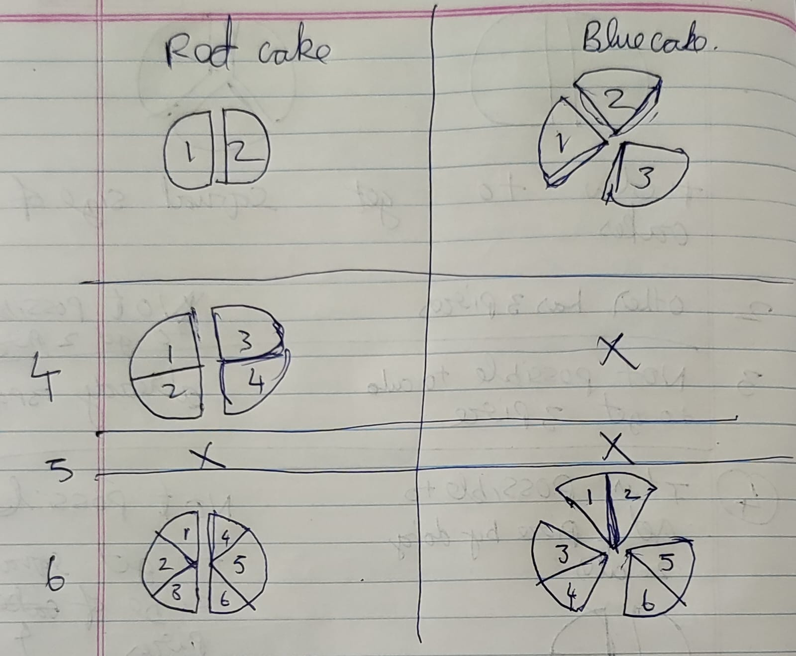

# Chapter 4: Fractions

## What is a Fraction?
A **fraction** is a way of showing parts of a whole.

### Why do we need fractions?
Sometimes we don’t use full things — we share or break them.

For example:

If you cut **1 cake** into **4 equal pieces**, and take **1 piece**,  
  you didn’t eat the full cake — you ate **one-fourth** of it.

We write this as: $\frac{1}{4}$

### $$Fraction = \frac{Part\ taken}{Whole\ part}$$

A fraction has **two parts**:

| Part            | Name            | Meaning                                 |
|-----------------|------------------|------------------------------------------|
| Top number      | **Numerator**    | How many parts you have (counted)        |
| Bottom number   | **Denominator**  | How many equal parts the whole is split into |

Example: $\frac{3}{5}$

This means **3 parts out of 5 equal parts**.

Imagine 1 chocolate bar cut into 5 equal blocks:

```
[■ ■ ■ □ □] -> You have 3 blocks out of 5 -> 3/5
```

### Visual Example (Cake)

- 1 cake is cut into 4 equal slices  
- You take 3 slices

Then: $\frac{3}{4}$

So:
- **Numerator = 3** (slices taken)
- **Denominator = 4** (total slices)

### How do we read fractions?

| Fraction       | Read as        | Meaning                     |
|----------------|----------------|-----------------------------|
| $\frac{1}{2}$ | one-half       | 1 part out of 2            |
| $\frac{2}{3}$ | two-thirds     | 2 parts out of 3           |
| $\frac{4}{5}$ | four-fifths    | 4 parts out of 5           |

>[!WARNING] 
>
>Fractions only make sense when the pieces are **equal** in size.  
>If they are **not equal**, it is **not a valid fraction**.

## Types of Fractions
There are **3 main types** of fractions:

### 1. Proper Fractions

A **Proper Fraction** is when the **numerator is smaller** than the denominator.

$$
\frac{3}{5}, \quad \frac{2}{7}, \quad \frac{1}{4}
$$

This means you have **less than one whole**.

Example:
1 cake is cut into 5 pieces, You take 3, You ate **3 out of 5**.

### 2. Improper Fractions

An **Improper Fraction** is when the **numerator is equal to or greater** than the denominator.

$$
\frac{5}{5}, \quad \frac{7}{4}, \quad \frac{9}{3}
$$

This means you have **one or more full wholes**.

Example:
Pizza is cut into 4 slices. You ate 7 slices, That’s **1 full pizza and 3 more slices**.

### 3. Mixed Fractions (Mixed Numbers)

A **Mixed Fraction** shows a **whole number + a proper fraction**.

Example:

$$
1\frac{3}{4}, \quad 2\frac{1}{2}
$$

This means: 

$$
1\frac{3}{4} = 1 + \frac{3}{4} = \frac{7}{4} 
$$

1 in the above means $\frac{4}{4}$ so you have $\frac{4}{4} + \frac{3}{4}$

$$
2\frac{1}{2} = 2 + \frac{1}{2} = \frac{5}{2}
$$

2 in the above means $\frac{2}{2} + \frac{2}{2}$ and $\frac{1}{2}$

### Why use Mixed Fractions?

Mixed numbers are easier to **understand in real life**.

Example: 1 cake and $\frac{3}{4}$ more = $(1\frac{3}{4})$

Instead of saying: “You ate $\frac{7}{4}$ cakes”, we say:\
“You ate $1\frac{3}{4}$ cakes”.

#### Mixed -> Improper

$$2 \frac{3}{4} = \frac{((2 * 4) + 3)}{4} =  \frac{8 + 3}{4} = \frac{11}{4}$$

1. Multiply whole number with Denominator\
    2 * 4 = 8
2. Add the result with Numerator \
    8 + 3 = 11
    This is the new Numerator
3. 11/4

what this mean?

    Object is grouped into set of 4 
    I have 2 full objects and 3 out of 4 parts of another object.
    Each object has 4 equal parts
    1. So 2 × 4 = 8 full parts
    2. Add 3 parts from the next object -> total = 11 parts out of 4 per object -> 11/4

#### Improper -> Mixed

$\frac{11}{4}$ = ( 2 full groups of 4) + ( 3 parts of another obj )
1. Divide numerator by denominator:\
    $11 ÷ 4$ = 2 remainder 3

2. That gives 2 full groups and 3 parts left out of 4\
    $2 \frac{3}{4}$

what this mean?  

    I have 11 pieces in total. Each group has 4 pieces.  
    So I have 2 full groups (2 × 4 = 8)  
    Plus 3 parts left out of 4 -> that’s 2 3/4 groups  

Equivalent Fractions – Same value, different form

$$\frac{1}{2} == \frac{2}{4} == \frac{4}{8}$$

### Can whole numbers be written as fractions?

Yes!

Any whole number can be written as a fraction like this:

$$
3 = \frac{3}{1}, \quad 5 = \frac{5}{1}
$$

This just means: "3 wholes = 3 full parts out of 1-per-whole"

So, whole numbers are **special cases** of fractions.

## Addition

### same denominator
$$\frac{2}{5} + \frac{1}{5} = \frac{3}{5}$$

#### Meaning
Cake is split into 5 pieces, initially you 2 pieces so $\frac{2}{5}$, then you again got $\frac{1}{5}$. In total we have $\frac{3}{5}$ 

### Different Denominators:
$$\frac{1}{2} + \frac{1}{3} = \frac{5}{6}$$

#### Meaning
Let’s say there are two cakes in a shop:
* The red cake is cut into 2 pieces
* The blue cake is cut into 3 pieces

You bought 1 piece from the red cake and 1 piece from the blue cake.
Now, how many cake pieces do you have in total?

The answer is not 2, because the red cake piece is bigger and the blue cake piece is smaller.
So how do we compare them fairly?

One way is to cut both cakes into equal-sized parts. Let’s try:

1. cut into 2 pieces
    - Red cake is already in 2 pieces ->  no need to cut
    - Blue cake is in 3 pieces -> not possible to get 2 equal parts

2. Cut into 3 pieces
    - Red cake can’t be cut exactly into 3 equal parts -> not possible
    - Blue cake already has 3 pieces -> no need to cut

3. Cut into 4 pieces
    - Red cake can be cut into 4 pieces (by cutting each of the 2 parts once)
    - Blue cake can’t be cut into 4 equal parts

4. cut into 5 pieces 
    - Not possible to get 5 equal pieces of red cake
    - Not possible to get 5 equal pieces of blue cake

5. cut into 6 pieces
    - Red cake: cut each half into 3 pieces -> 2 × 3 = 6 pieces
    - Blue cake: cut each third into 2 pieces -> 3 × 2 = 6 pieces

Now both cakes are cut into 6 equal pieces, so we can compare and add them.



Red cake we have $\frac{1}{2}$, we own 1 out of 2 pieces, To get 6 pieces, cut each pieces into 3 times.  
so $(\frac{1 * 3}{2 * 3}) = \frac{3}{6}$, if Red cake is splitted into 6 we own 3.  

Blue cake we have $\frac{1}{3}$, we own 1 out of 3 pieces, To get 6 pieces, cut each pieces into 2 times.  
so  $(\frac{1 * 2}{3 * 2}) = \frac{2}{6}$, if Blue cake is splitted into 6 we own 2 pieces

Above we found the common smallest divisible values of both number to get equal share
That commaon divisble is easy to find using `LCM`.

##### LCM (Least Common Multiple)
The smallest number that is a multiple of both numbers.
So the Least Common Multiple is the first number that appears in both multiplication tables.

Example: LCM of 2 and 3
Multiples of 2: 2, 4, 6, 8, 10, 12...
Multiples of 3: 3, 6, 9, 12...
The first common multiple is 6 LCM(2,3)=6

## Subtraction

### Same Denominator:
$\frac{3}{4} - \frac{1}{4}$ = ?  
3 - 1 = 2 \
$\frac{2}{4}$ = $\frac{1}{2}$

This is same as above

### Different Denominators:

$\frac{5}{6} − \frac{1}{4}$ = ? \
LCM(6,4) = 12 \
new Denominator = 12 

1. $\frac{5}{6}$

   $\frac{12}{6} = 2$, every portion we have 2 parts in it
   $5 * 2 = 10$, 5 portions we own and each portion has 2 parts, now total we have $\frac{10}{12}$

2. $\frac{1}{4}$

   $\frac{12}{4} = 3$, every portion we have 3 parts in it\
   1 * 3 = 3, 1 portion we own, in that 3 parts are there, now total $\frac{3}{12}$

   $\frac{10}{12} - \frac{3}{12} = \frac{7}{12}$

## Multiplication

In general multiplication means we are repeating or scaling
But in fraction multiplying fractions, we’re no longer just repeating — we’re scaling or taking a part of a part.

### Whole number with fraction
1.
$$
5 * \frac{1}{2} = \frac{5}{2} 
$$

$$
\frac{1}{2} + \frac{1}{2} + \frac{1}{2} + \frac{1}{2} + \frac{1}{2} = \frac{5}{2}
$$

$$\frac{5}{2}\ is\ improper\ fraction$$

2.
$$
10 * \frac{2}{3} = \frac{20}{3}
$$

$$
\frac{2}{3} + \frac{2}{3} +\frac{2}{3} +\dots + \frac{2}{3} = \frac{20}{3}
$$

$$\frac{20}{3}\ is\ improper\ fraction$$

3.
$$
2 * \frac{1}{3} = \frac{1}{3} + \frac{1}{3} = \frac{2}{3}
$$

$$\frac{2}{3}\ is\ proper\ fraction$$

### Fraction number with fraction
