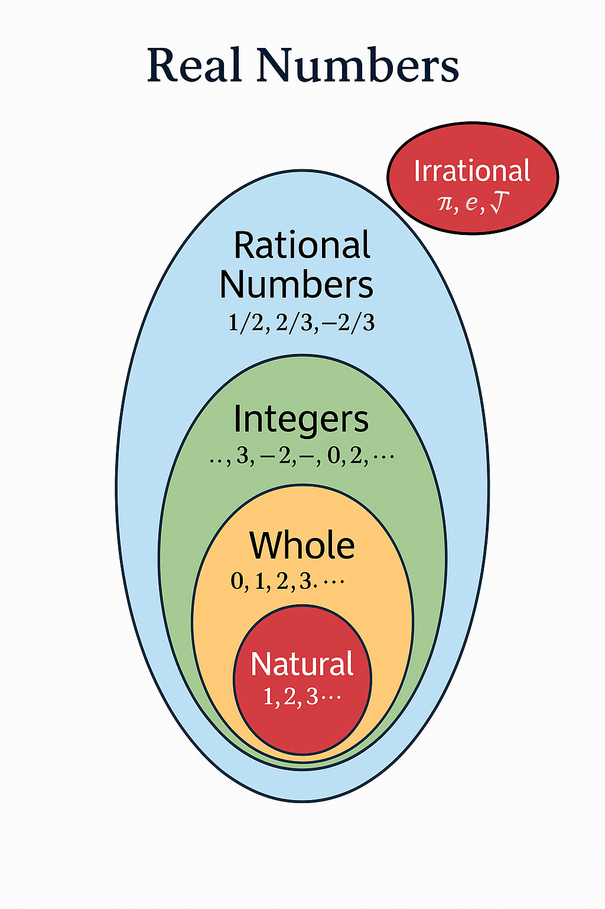

# Chapter 1: Understanding Numbers 

## Introduction

### What numbers really are and why they exist

**Have you ever wondered...**

* Why do we need numbers at all?
* What did people do before numbers were invented?
* Why are there different types of numbers?
* How did ancient people count without our number system?

**Imagine a world without numbers...**  
Picture this: You wake up and want to meet your friend. How would you tell them the time? You can't say "3 o'clock" because numbers don't exist!  

You go to buy bread. How would you ask for "2 loaves" or pay with "5 coins"?  

You want to share pizza with friends. How would you divide it fairly without knowing "half" or "quarter"?  

**This is exactly the world our ancestors lived in thousands of years ago!**

### The Birth of Numbers: A Human Story

**Step 1: The Counting Problem**  

Long ago, shepherds had a problem. They needed to know if all their sheep came back home. But they didn't have numbers!

Their solution? They used one-to-one matching:

* For each sheep going out, they put one stone in a bag
* When sheep returned, they took out one stone for each sheep
* If stones were left in the bag, some sheep were missing!

This was the birth of **counting** - the very first use of numbers.

**Step 2: The Growing Problem**  

As civilizations grew, people needed to count bigger things:
* How many bags of grain do we have?
* How many days until the next full moon?
* How many soldiers are in our army?

Stones became impractical. People started using:
* Tally marks (||||)
* Body parts (fingers, toes)
* Words for quantities

**Step 3: The Writing Problem**  
Eventually, people needed to write down these quantities. Different civilizations created different systems:

* Egyptians: Used hieroglyphs
* Romans: Used letters (I, V, X, L, C, D, M)
* Arabs/Indians: Created the system we use today (1, 2, 3, 4...)


### Why Numbers Are Everywhere

Numbers aren't just mathematical tools - they're the language of the universe:

**In Daily Life**

**Time**: "I'll meet you in 15 minutes"  
**Money**: "This costs $10"  
**Cooking**: "Add 2 cups of flour"  
**Sports**: "The score is 3-2"  

**In Nature**

**Flower petals**: Most flowers have 3, 5, or 8 petals  
**Bee hexagons**: Perfect 6-sided shapes  
**Spiral shells**: Follow mathematical patterns  
**Human body**: 2 eyes, 10 fingers, 32 teeth  

**In Technology**

**Computers**: Everything is 0s and 1s  
**Music**: Notes follow mathematical ratios  
**Architecture**: Buildings use geometric proportions  
**Internet**: Every website has a numerical address  

### Fun Facts to Get You Started
**The Number Zero**

Zero was invented around 628 AD in India
Romans had no symbol for zero - they just left blank spaces!
Zero is neither positive nor negative

**The Number Pi (π)**

Has been calculated to over 50 trillion decimal places
Appears in circles, but also in probability and statistics
Its decimal expansion never repeats or ends

**Negative Numbers**

Chinese mathematicians used red and black rods for positive and negative
European mathematicians rejected negative numbers for centuries
They're essential for modern science and technology

**The Golden Ratio**

Found in flower petals, spiral shells, and human faces
Artists use it to create pleasing proportions
It's an irrational number: 1.618033988...

## What is number system

### Let's Think About It
Point to a "3" in your room.Can you do it?  

You might point to:
* The number "3" written on a clock
* 3 books on a shelf
* 3 fingers on your hand  

But here's the fascinating part: **The number "3" itself doesn't exist as a physical thing!**

A number is a mental concept that describes a physical object
* **Quantity**: How many things there are
    
    3 apples, 7 days, 24 hours,..
* **Value**: How much something is worth

    200 Rupees, 2 Dollar,..
* **Position**: Where something is in a sequence

    1st position, your birthday is on 15th
* **Relationship**: How things compare to each other

    Price of this product is 20% cheaper that other,..

The mathematical idea that exists in our minds. This is the same for all humans, regardless of language or culture.

## Counting and Natural Numbers
Counting numbers are the numbers we use when we count things one by one.  
They start from 1 and go on

    Natural Numbers = Counting Numbers = 1, 2, 3, 4, 5, …

**N** = {1, 2, 3, ...}

**Properties**  
* Always positive  
* Never ends

## Adding Zero - Whole Numbers

### Why Introduce Zero?
Imagine you have 5 pencils. Now, you give away all 5. How many do you have left?

You might say: "Nothing!". But how do we write "nothing" in math?

We use the number zero (0).

### What Are Whole Numbers?
Once zero was invented, mathematicians extended the set of natural numbers.

    Whole Numbers = Natural Numbers + Zero

**W** = { 0, 1, 2, 3, 4, 5, ... }

**Properties**  
* It is neither positive nor negative.

## Going Below Zero - Integers

### Why below zero?
You have 3 apples. You give away 5 apples. How can you give more than you have?  
You're in debt — you owe 2 apples. But how do we write this in math? This is where negative numbers come in.

Negative numbers represent values less than zero.
They are used when something is missing, lost, owed, or below a baseline.

### What Are Integers?

    Integers = All positive numbers, zero, and negative numbers

**Z** = { ..., -3, -2, -1, 0, 1, 2, 3, ... }

| Question                                | Answer |
| --------------------------------------- | ------ |
| Is -2 less than 0?                      | Yes    |
| Is -5 less than -3?                     | Yes    |
| Is -1 greater than -5?                  | Yes    |
| Is 0 greater than all negative numbers? | Yes    |

## Parts of Numbers - Rational Numbers 

### What If a Number Isn't Whole?
Imagine you cut a cake into 4 equal pieces.
You eat 1 piece. How much of the cake did you eat?

Not a whole cake. Just a part.
We write this part as a fraction:
1/4 (one-fourth)
4/4 (means you have full cake which is splitted into 4 pieces)
5/4 (means you have one whole cake + 1 extra piece)

This kind of number — a part of a whole — is called a **rational number**.

### What Is a Rational Number?
A rational number is any number that can be written in the form: **a/b**

Where:
* a is an integer (positive, negative, or zero)
* b is a non-zero integer

| Expression | Value | Type                            |
| ---------- | ----- | ------------------------------- |
| 1 / 2      | 0.5   | Proper fraction                 |
| 5 / 2      | 2.5   | Improper fraction               |
| 1 1/2      | 1.5   | Mixed number                    |
| -3 / 4     | -0.75 | Negative fraction               |
| 6 / 3      | 2     | Whole number                    |
| 0 / 5      | 0     | Zero (valid rational number)    |
| -10 / 1    | -10   | Negative integer                |
| 2.25       | 9 / 4 | Decimal form of rational number |


Any terminating or repeating decimal is a rational number.
* 0.75 = 3/4 (terminating)
* 0.333… = 1/3 (repeating)

Every integer, finite decimal, or repeating decimal is rational.

## Numbers We Can't Write Simply - Irrational Numbers

### What If a Number Never Ends and Never Repeats?
You’ve seen that rational numbers can be written as fractions like 1/2 or 3/4.
Even repeating decimals like 0.333… (which is 1/3) are rational.  

But what about numbers like:
* √2 = 1.4142135...
* π = 3.14159265...

These numbers:
* Never end
* Never repeat
* **Cannot be written as a fraction a/b**

### Why Are Irrational Numbers Important?
Even though you can’t write them exactly as fractions, irrational numbers are everywhere:

* Circles (π)
* Right triangles (√2, √3)
* Sound waves and signals
* Natural proportions
* Computer algorithms (approximate them)

--------
Example

1. Let’s say you draw a square.  
    Each side is 1 unit long.  
    Now draw a line from one corner to the opposite corner — a diagonal.  
    How long is that line?  

    You might guess:  
    “Maybe 1.5?” or “Maybe 2?”  
    But actually, it’s about 1.414…  
    That’s √2 again — an irrational number.  

2. Do you know what π (pi) is?
    It’s the number we use to:  
    * Find how long around a circle is  
    * Find the area inside a circle  

Imagine a number line:

    0---1---2

Between 1 and 2, we already have: {1.1, 1.2, 1.3...} or {3/4, 7/8, 5/6...} But there are still tiny holes — values that are not fractions, not decimals, and not repeating.

Irrational numbers fill those holes so the line is fully complete.

    We need irrational numbers because some real things in life — like square roots and circles — can't be explained using only normal numbers or fractions.

## The Complete Picture - Real Numbers
Numbers are classified as 5 types
1. Natural {1,2,3,...}
2. Whole   {0,1,2,3,..}
3. Integers {-infinity,...,-3, -2, -1, 0, 1, 2, 3, .... +infinity}
4. Rational {5/2, 0.63, 0.012} which ever numbers can be written as p/q, where q not equal to 0
5. Irrational {sqrt(3), pi, 0.101001...} The numbers which are not rational and cannot be written in the form of p/q

```
Real Numbers
├── Rational Numbers
│   ├── Integers
│   │   ├── Whole Numbers
│   │   │   └── Natural Numbers
│   └── Fractions and Decimals
└── Irrational Numbers
```

This whole 5 types is combined as real numbers

    Real numbers are all the numbers that can be placed on the number line.



## How We Write Numbers - Place Value System

| Place         | Value       |
| ------------- | ----------- |
| Crores        | 1,00,00,000 |
| Ten Lakhs     | 10,00,000   |
| Lakhs         | 1,00,000    |
| Ten Thousands | 10,000      |
| Thousands     | 1,000       |
| Hundreds      | 100         |
| Tens          | 10          |
| Ones          | 1           |

1. the number 73,42,615 means:

    1. 7 ten lakhs = 70,00,000
    2. 3 lakhs = 3,00,000
    3. 4 ten thousands = 40,000
    4. 2 thousands = 2,000
    5. 6 hundreds = 600
    6. 1 ten = 10
    7. 5 ones = 5

    Add it all:
    `73,42,615 = 70,00,000 + 3,00,000 + 40,000 + 2,000 + 600 + 10 + 5`


2. 45.37

    | Digit | Place      | Value            |
    | ----- | ---------- | ---------------- |
    | 4     | Tens       | 4 × 10 = 40      |
    | 5     | Ones       | 5 × 1 = 5        |
    | 3     | Tenths     | 3 × 1/10 = 0.3   |
    | 7     | Hundredths | 7 × 1/100 = 0.07 |

    `45.37 = 40 + 5 + 0.3 + 0.07`