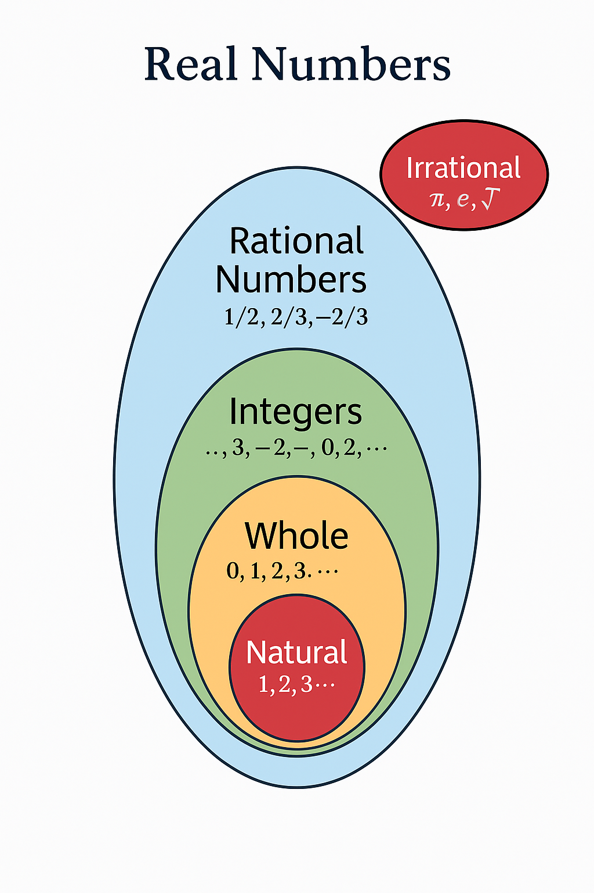

# Basic math
    In this page lets assign 1 as 1, 2 as 11, 3 as 111, 4 as 1111,... 
## Addition
    2 + 4 = 6, why 6?
    2 = 1 1
    4 = 1 1 1 1

    2 + 4 = 1 1 + 1 1 1 1 -> 1 + 1 + 1 + 1 + 1 + 1 = 1 1 1 1 1 1 -> 6  

## Multiplication 
    2 * 4 = 8, why 8?, it is like 2 times adding 4 or 4 times adding 2
    2 = 1 1
    4 = 1 1 1 1
    here want to add each 1 in 2 with 1 in 4
    2 has 1 1 and 4 has 1 1 1 1
    taking 1st 1 from 2 add with all the 1 in 4
    1 1 1 1 (for 1st 1 in 2)
    1 1 1 1 (for 2nd 1 in 2)
    now add both result -> 1 1 1 1 1 1 1 1 -> 8

## Subtraction
    5 − 2 = 3
    5 -> 1 1 1 1 1
    2 -> 1 1
    ---------------------
         0 0 1 1 1
    form five take two, 1's -> 1 1 1 -> 3

## Division 

    Division is about splitting or grouping.

    1. Sharing (Equal distribution)

        “I have 6 chocolates and 2 friends. If I share equally, how many does each get?”

    2. Grouping (How many groups of something fit?)

        “I have 6 chocolates. How many groups of 2 can I make?”
    
    6 % 2 = 3
    6 -> 1 1 1 1 1 1 now group 1's in 6 as 2
    [1,1], [1,1], [1,1] now we have total 3 group

    7 % 2 = 3.5
    7 -> 1 1 1 1 1 1 1 now from a group of 2
    [1,1], [1,1], [1, 1], [1] here 3 group are full and 4th group is half so .5

## Number system types
Numbers are classified as 5 types
1. Natural {1,2,3,...}
2. Whole   {0,1,2,3,..}
3. Integers {-infinity,...,-3, -2, -1, 0, 1, 2, 3, .... +infinity}
4. Rational {5/2, 0.63, 0.012} which ever numbers can be written as p/q, where q not equal to 0
5. Irrational {sqrt(3), pi, 0.101001...} The numbers which are not rational and cannot be written in the form of p/q

This whole 5 types is combined as real numbers

## Negative 

Positive numbers: `+1, +2, +3`  → things you have  
Negative numbers: `–1, –2, –3` → things you owe or remove

### Add

    3 + (–2) = 1
    i have:     +1 +1 +1  
    i owe:       –1 –1  
    Result:    +1  (Only one positive 1 is left)

### Subtract

    Subtracting a negative is like removing a debt, which increases what you have.

    5 − (–2) = 5 + 2 = 7
    i have 1 1 1 1 1
    remove - 
    owing -1 -1
    result: it is like remove owing so, in last i own all the things 

    Real-World Analogy: Money
    You have ₹500.
    You owed ₹200.

    But your friend says: “You don’t have to pay me back.” So that ₹200 debt is gone.
    That means you’re now ₹200 richer.

    So: 500−(−200)=500+200=700

### Multiply

    1. + X + = +
    2. - X + = -
    3. + X - = -
    4. - X - = +  

    why the rule?, let assume - as debt  
    from +(no debt) X + adding (+)  = gain +  
    from -(debt) X + adding (+) = here it is adding the debt, so lose  
    from adding (+) X the debt(-) = here also adding the debt, so lose  
    from - (debt) X removing (-) = so here gaining +

| A  | B  | A × B = | Meaning                    |
| -- | -- | ------- | -------------------------- |
| +2 | +3 | +6      | Gain × Gain = More gain    |
| +2 | –3 | –6      | Gain × Debt = Lose         |
| –2 | +3 | –6      | Debt × Gain = Still lose   |
| –2 | –3 | +6      | Debt × Debt removed = Gain |

### Division

    same logic as multiply
    6 ÷ (–2) = –3
    –6 ÷ 2 = –3
    –6 ÷ (–2) = +3

## Fractions
 A fraction represents a part of whole

Numerator/Denominator

 Numerator: The top number → how many parts you have  
 Denominator: The bottom number → total parts in a whole

 eg: Taking pizza as a example, whole pizza is one also 1/1 
    meaning is 1(you have)/1(total parts it splitted) so here we have one whole pizza

    1/4 means
    whole pizza is splitted into 4 pieces it is the Denominator, I have 1 out of the four part (Numerator)

    3/4 means
    whole pizza is splitted into 4 pieces it is the Denominator, I have 3 out of the four part (Numerator)

    4/4 means
    whole pizza is splitted into 4 pieces it is the Denominator, I have all the four part (Numerator)

### Types of fraction 

1. Proper Fractions – Numerator < Denominator 

    `2/5`, `3/8`  

2. Improper Fractions – Numerator ≥ Denominator  

    `5/4`, `7/3`

3. Mixed Numbers – Whole number + Proper fraction

    `1 1/2`, `2 3/4`

#### Mixed → Improper

    2 3/4 = ((2 x 4) + 3)/4 = 8 + 3/4 = 11/4

    1. Multiply whole number with Denominator 
        2 * 4 = 8
    2. Add the result with Numerator 
        8 + 3 = 11
        This is the new Numerator
    3. 11/4

    what this mean?
        Object is grouped into set of 4 
        I have 2 full objects and 3 out of 4 parts of another object.
        Each object has 4 equal parts
        1. So 2 × 4 = 8 full parts
        2. Add 3 parts from the next object → total = 11 parts out of 4 per object → 11/4

#### Improper → Mixed

    11/4 = ( 2 full groups of 4) + ( 3 parts of another obj )

    1. Divide numerator by denominator:
       11 ÷ 4 = 2 remainder 3

    2. That gives 2 full groups and 3 parts left out of 4
        2 3/4
    
    what this mean?
    I have 11 pieces in total. Each group has 4 pieces.
    So I have 2 full groups (2 × 4 = 8)
    Plus 3 parts left out of 4 → that’s 2 3/4 groups

4. Equivalent Fractions – Same value, different form

    `1/2` == `2/4` == `4/8`

### Fraction operations

#### Addition 

#### same denominator  

    2/5 + 1/5 = 3/5
    Think as 2 parts of 5 and one more part of 5, i have, so total 3/5

    Both are parts of the same whole (cut into 5).

### Different Denominators:

    1/2 + 1/3 = 5/6
    meaning 1 part of 2 and 1 part of 3 i have

    1. Convert both to same denominator by building equal parts:
    1/2 = 3/6 (divide each half into 3 pieces)
    1/3 = 2/6 (divide each third into 2 pieces)
    2. Now add:
    3/6 + 2/6 = 5/6

    You broke both fractions into 6 parts (smallest common size).
    Together, you own 5 parts out of 6.

Here doubt will be how to find common Denominator?
Let’s say there are two cakes in a shop:
* The red cake is cut into 2 pieces
* The blue cake is cut into 3 pieces

You bought 1 piece from the red cake and 1 piece from the blue cake.
Now, how many cake pieces do you have in total?

The answer is not 2, because the red cake piece is bigger and the blue cake piece is smaller.
So how do we compare them fairly?

One way is to cut both cakes into equal-sized parts. Let’s try:

1. cut into 2 pieces
    - Red cake is already in 2 pieces → ✅ no need to cut
    - Blue cake is in 3 pieces → ❌ not possible to get 2 equal parts

2. Cut into 3 pieces
    - Red cake can’t be cut exactly into 3 equal parts → ❌ not possible
    - Blue cake already has 3 pieces → ✅

3. Cut into 4 pieces
    - Red cake can be cut into 4 pieces (by cutting each of the 2 parts once) → ✅
    - Blue cake can’t be cut into 4 equal parts → ❌

4. cut into 5 pieces 
    - Not possible to get 5 pieces of red cake → ❌
    - Not possible to get 5 pieces of blue cake → ❌

5. cut into 6 pieces
    - Red cake: cut each half into 3 pieces → 2 × 3 = 6 pieces → ✅
    - Blue cake: cut each third into 2 pieces → 3 × 2 = 6 pieces → ✅

Now both cakes are cut into 6 equal pieces, so we can compare and add them.

####  Finding How Many Pieces We Own

Let’s say we want to add:
1/2 + 1/3
We choose to cut both cakes into 6 equal pieces (because 6 is a size both cakes can be cut into).

1. Convert 1/2 into sixths
* Red cake was cut into 2 pieces.
* We now imagine each of those 2 big pieces is cut into 3 smaller pieces → so 2 × 3 = 6 total pieces.
Since we had 1 out of 2, and now each big piece became 3 small ones:
We now own 3 out of 6 => 1/2=3/6

2. Convert 1/3 into sixths
* Blue cake was cut into 3 pieces.
* We now cut each of those 3 pieces into 2 smaller ones → 3 × 2 = 6 total pieces.
Since we had 1 out of 3, and each pieces became 2 smaller ones:
We now own 2 out of 6 => 1/3=2/6

3. now add them 3/6 + 2/6 = 5/6 pieces of cake i have

In the formula it can be written like this
`New numerator = old number of parts we are owning × (new total parts ÷ old total parts)`

How 3 / 6 and 2 / 6

Total 6 pieces,

Red cake: they splitted into 2 pieces so 6 / 2 = 3,  This means each of the 2 old pieces is now 3 smaller slices.
We own 1 piece of the red cake. That 1 piece is now 3 small pieces.
    1(piece we already owned in old piece) * 3 (new splitted value) = so we are owning 3 pieces out of 6

Blue cake: they splitted into 3 pieces so 6 / 3 = 2, This means each of the 3 old pieces is now has 2 smaller slices.
We own 1 piece of the blue cake. That becomes 2 small pieces.
    1(piece we already owned in old piece) * 2 (new splitted value) = so we are owning 2 pieces out of 6 

To test the calculation, 2 / 3, 2 / 2 here also common Denominators is 6

1. 2/3  
2 (numerator) * 6 = 12   
12/3 (denominator) = 4  

4/6  

2. 2/2   
2 (numerator) * 6 = 12   
12 / 2 (denominator) = 6   

6/6  

2. 4/6 + 6/6 = 10/6

##### LCM (Least Common Multiple)
The smallest number that is a multiple of both numbers.
So the Least Common Multiple is the first number that appears in both multiplication tables.

Example: LCM of 2 and 3
Multiples of 2: 2, 4, 6, 8, 10, 12...
Multiples of 3: 3, 6, 9, 12...
The first common multiple is 6 LCM(2,3)=6

### Subtraction

#### Same Denominator:
3/4 − 1/4 = ?
3 - 1 = 2
2/4 
1/2

#### Different Denominators:
5/6 − 1/4 = ?
LCM(6,4) = 12
new Denominator = 12

1. 5/6
   12 / 6 = 2, every portion we have 2 parts in it
   5 * 2 = 10, 5 portions we own and each portion has 2 parts, now total we have 10/12
2. 1/4
   12 / 4 = 3, every portion we have 3 parts in it
   1 * 3 = 3, 1 portion we own, in that 3 parts are there, now total 3 / 12

   10 /12 - 3 / 12 = 7 / 12

### Multiplication
1/2 * 1/3 = 1/6

Say you have half of a chocolate bar. (1/2)
Now you want to eat one-third of that half. (1/3)
So, take that half, divide it into 3 parts, and pick 1 → you’ve eaten 1 out of 6 parts of the full bar.

2/3 * 4/5

Multiply top (numerators): 2 × 4 = 8
Multiply bottom (denominators): 3 × 5 = 15
Result: 8/15

When to Multiply Fractions
Scaling: e.g., I want 3/4 of a pizza and I eat only 1/2 → how much did I eat in whole pizza? 3 / 8
How? i have 3 piece, in that i want to eat half, so i will split each piece into 2, so total pizza have 8 pieces, in that i own 6, and i eat half that is 3, so 3/8

#### Multiplying with Whole Numbers
3/4 * 2 = (3 * 2)/4 = 6 / 4 = 1 1/2

You eat 3/4 of a cake per day. 🍰
How much will you eat in 2 days?

So in 2 days, you eat 1 and a half cakes.

### Division
